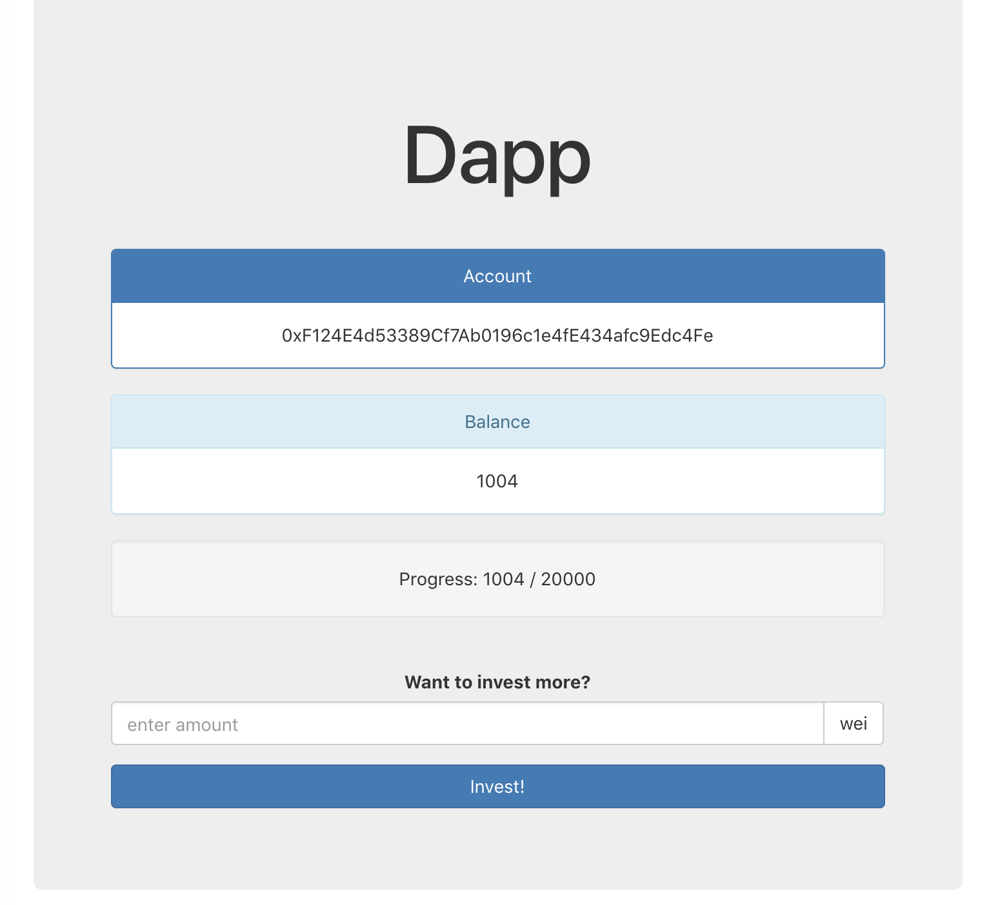

##Smart dapp

App is bootstrapped using create-react-app [https://github.com/facebook/create-react-app]. You can use app for checking your metamask account balance, investing into predefined ICO, viewing your ICO token balance and percentage of collected Wei for ICO.

Note: For proper app functioning you need to have metamask chrome extension installed.

To run the app locally, please run `yarn` and then `yarn start`.

You can also use `docker` to run the app.

